# p4-t2-networking-Gandares

En la anterior práctica vimos como crear un servidor HTTP, en este caso, un servidor TCP usando "require('net')".

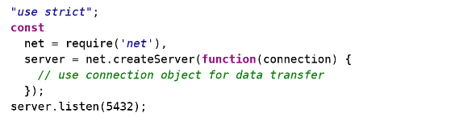

Llamando a "server.listen(60300)" se le asigna al puerto 60300 el servidor.
La función "net.createServer()" retorna un objeto tipo server, node invoca la función de la callback cada vez que un usuario se conecte al servidor. Cabe decir que el protocolo TCP se basa en dos puntos, uno enlazado a un puerto en específico y el otro el puerto del que se va a conectar. 

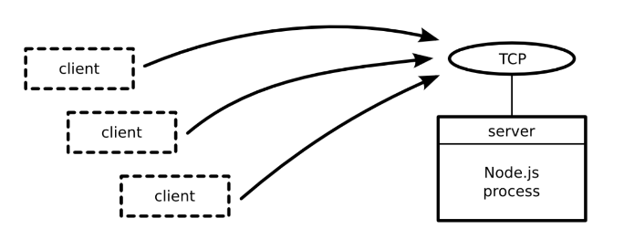

Al igual que en las anteriores prácticas, hemos realizado un programa para observar cuando se cambia un archivo especificado, usando net y fs. El pograma fija el puerto 5432 para el sevidor y una vez se conecte con telnet empieza a observar cambios del archivo citado.

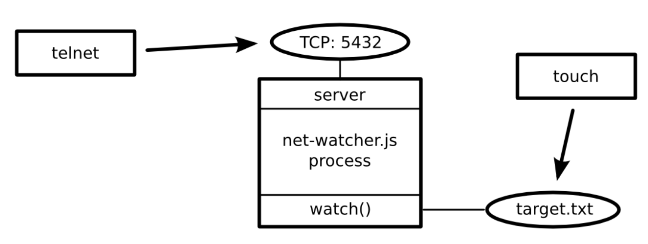

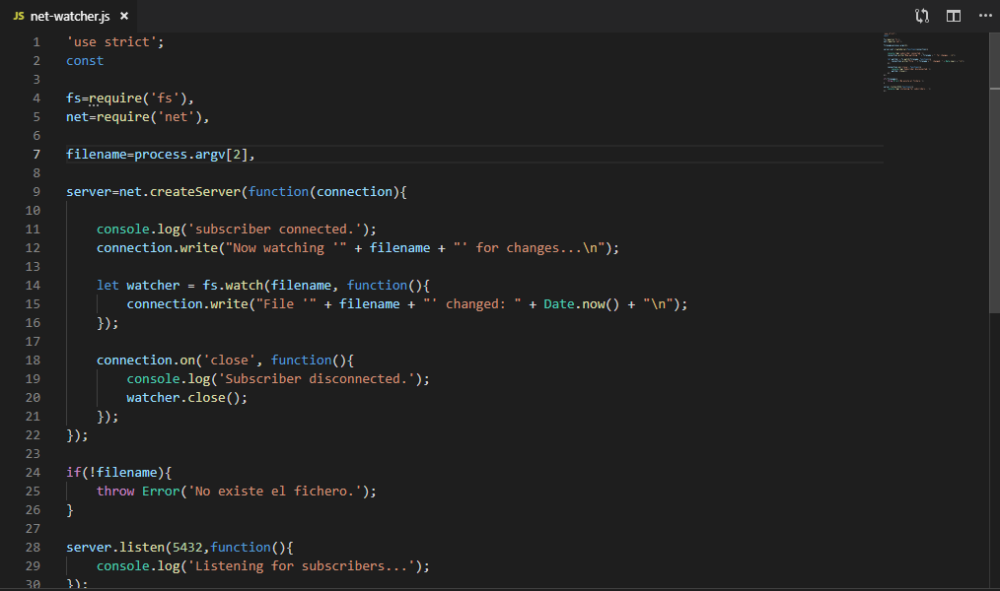

Usando telnet para conectarnos al servidor, se puede observar el comportamiento del programa, desde el pppunto de vista del usuario.

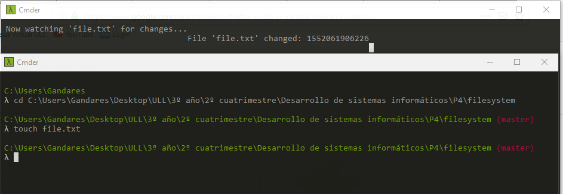

Ahora crearemos con JSON un protocolo para asignar el funcionamiento en el que estos dos extremos se conectan.
En el siguiente ejemplo cuando nos conectamos a tellnet nos popndrá que estamos "watching"(observando) el archivo "file.txt", que es el que cité y cuando se hace una modificación sobre él, muestra "changed" como que ha sido modificado el archivo "file.txt" y con un timestamp de x, este timestamp, muestra la fecha en la que se hizo la modificación en milisegundos desde el 1/1/1970.

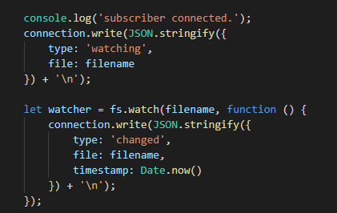

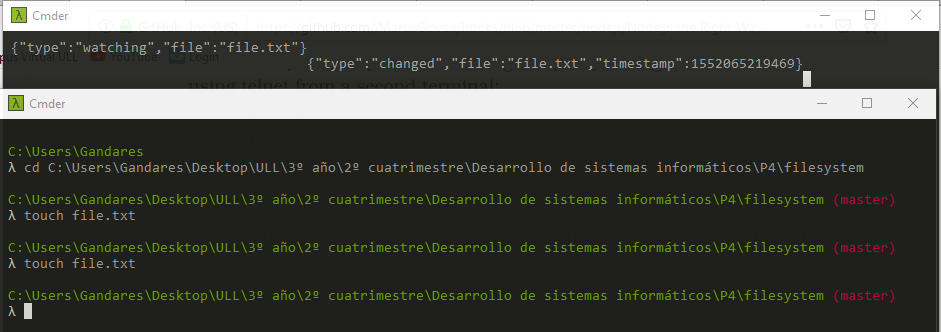

En el siguiente ejemplo, se crea un programa sencillo para que el cliente se conecte al servidor por el puerto 5432. PPara ello se debe abrir el servidor antes y después conectarnos, cualquier cambio en el archivo "file.txt" pues como veíamos antes por el telnet, se verá en el programa del cliente.

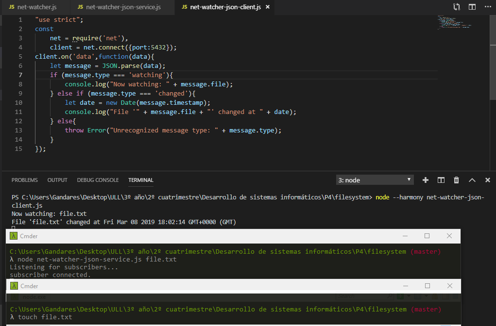

En el siguiente ejemplo, intentamos mandar un mensaje fragmentado pero al usar "JSON.parse(), que espera cadenas completas, al llegarle la segunda le llega en un formato que no es y suelta un error.

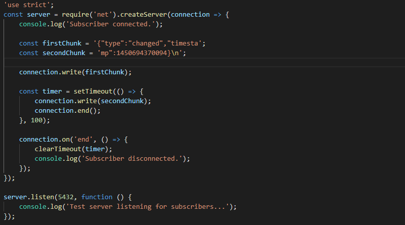

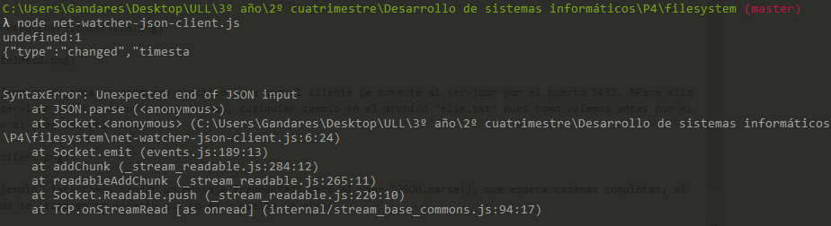

En el anterior ejemplo, como vimos, el programa cliente trataba de hacer dos tareas a la vez. Es correcto no agruparlas y al menos convertir una de ellas en un módulo, esto se hará con herencia. En un programa exportamos la funcionalidad en un módulo y en otro importamos el módulo de manejo de mensajes:

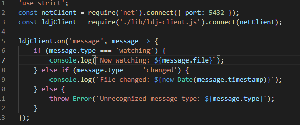

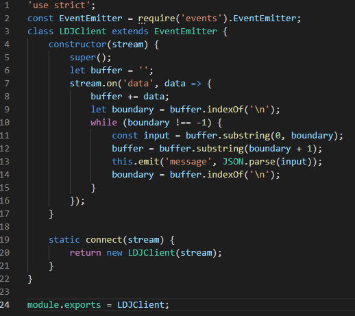

